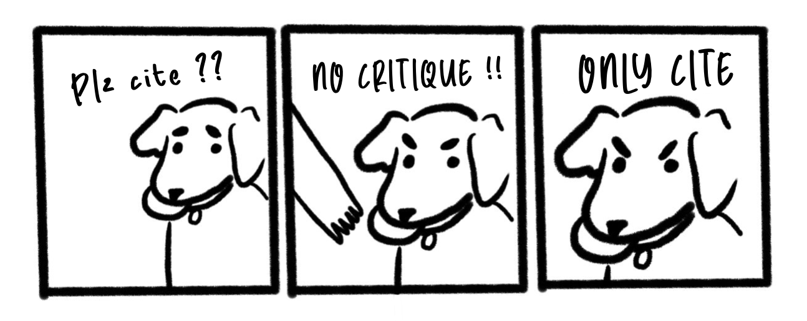

I think science often takes the requirement that criticism be constructive too far. Most definitions of constructive criticism refer to feedback that is intended to help by pointing out flaws in a way that is specific, actionable, and respectful. This is good, I’m in favor of it. 

However, in practice, the demands for constructive criticism in science go much further: frequently, we are told that, to publicly point out serious flaws, you must also solve them, and to do otherwise is somehow rude, unscholarly, or low effort. This is the logic:

> π equals exactly 3.  
> Any criticism of this claim must also provide the correct exact decimal representation of π.

While often well-intentioned, this requirement gets in the way of scientific self-correction. My position is that identifying serious flaws in scientific work is itself a contribution and should not be contingent on fixing the original work.

I have written several critiques of published articles and measures.[<a href="#ref1">1</a>–<a href="#ref6">6</a>] Without fail, every one of them has been met with responses along the lines of “a serious critique would provide a better answer to the question.” I can see where these folk are coming from, but I totally disagree, and I want to explain why. I’m quite sure that others have made all these points before, but in the absence of a specific source I can point to when I encounter this point, I thought I would assemble my thoughts here. 

Scientific self-correction is already a painfully slow and flawed process. Others have noted that critique is often held to a much higher bar than original work, that the incentive structures in academia reward doing flawed original work more than correcting existing flawed claims.[<a href="#ref7">7</a>, <a href="#ref8">8</a>] For science to be self-correcting – an adage that we like to repeat but rarely operationalize[<a href="#ref9">9</a>] – it should be possible to rapidly disseminate critique. Requiring that those who identify serious flaws must also provide solutions serves to slow or disincentivize critique. 

I think that third-parties (e.g., editors, reviewers, spectators on social media) who request that critiques come with fixes are usually well-intentioned. They are correct that the ideal critique would solve the issue raised. But there are at least four systemic problems with this requirement. Of course, when it is the original authors themselves who insist that I solve their issue before critiquing them, their motivations for taking this stance are often more clear-cut.

First, this requirement shifts the burden of proof from the original authors to critics, creating a perverse incentive for flaws to be as complex and difficult to solve as possible. The more difficult my issues are to solve, the less others are permitted to point out that they exist in the first place. *“π = 3, and you may not point out I am wrong unless you can tell me the correct answer.”* Insisting that public identification of flaws must come with fixes slows and disincentivizes critique. 

Second, identifying flaws in scientific work is an uphill struggle against Brandolini’s Law[<a href="#ref10">10</a>]: the idea that it takes much more effort to identify and correct issues than to make them. If we want science to be self-correcting, we need to make it harder to assert incorrect claims in the first place and generally easier to critique claims. 

This point is closely related to an asymmetry in the demands for rigour we place on critique versus praise.[<a href="#ref11">11</a>] This is a more general point that extends well beyond requiring solutions to point out flaws: imagine if we required people to verify a result before they ever praise or cite it. “No citation without verification” would likely be considered unworkable or too high a bar. And yet it is exactly the rule that we apply to critique. 

Third, this requirement ignores opportunity costs. In the extra time that it takes to create a solution before vocalizing any public critique, the demonstrably flawed original work often continues to be cited and used. Effective correction is rapid. To draw a parallel with the maxim “justice delayed is justice denied,” delayed scientific correction is weak and less effective.

Fourth – and this point is hard to unsee once it has been pointed out to you – demands that critiques include fixes generally lack reflexivity or are borderline hypocritical. If you think my critique of a meta-analysis should involve also reporting a better meta-analysis that answers the original question, why haven’t you done that better meta-analysis before critiquing my critique? I often want to reply, “Your critique of my critique would be better if you fixed my critique by fixing the original work.” But I bite my tongue. This isn’t (merely) pedantry; it’s important to highlight that I have never seen any consistent commitment, with personal follow through, to the demand that critique must fix the issue. 

Loosely speaking, it must be allowable in some scientific contexts to reply to the claim that “π equals exactly 3” with the equivalent of “No, it doesn't, here is the proof.” 

This usually raises the question: can such replies come off as rude? Yes, sometimes, to some people. Am I advocating that we abandon civility or constructive criticism? Of course not. Be professional and human. I am saying that we currently collectively adhere to the rule that “merely” pointing out serious flaws is currently often proscribed or forbidden, despite the clear scientific utility of doing so. The extremity of this implicit rule needs to be recognized: academia, the industry whose main purpose is truth discovery, is surprisingly uncomfortable with people pointing out things that are not true. It often perceives such critique as an attack on the original work, or even a personal attack on its authors, rather than an effort to evaluate claims about the world ([<a href="#ref12">12</a>].

This proposal, that we permit people to point out problems without also requiring them to fix them, is much less radical once you have been on the receiving end of them as a critic. For example, I have pointed out that certain meta-analyses contain objective errors that seriously undermine their conclusions.[3,5] This work took serious amounts of time and effort – sometimes years – and yet I am routinely told that, to be publishable, my critique should also conduct a new systematic review and meta-analysis from scratch that answers the original authors’ questions. Elsewhere, I have committed time and effort to point out that a given measurement instrument is unreliable,[1,4] but was routinely told that I should produce and validate a better measure. As with much pushback against critique and post-publication peer review in science, I encourage folk to try it themselves and experience how frustrating the process can be. Direct experience of these perverse incentives generally makes you more sympathetic to such efforts (e.g., experiences such as Joe Hilgard’s[<a href="#ref13">13</a>]).

For science to be self-correcting, pointing out flaws does not also require simultaneously solving them. It is important to be able to state that π does not equal 3.

## Acknowledgements

Many thanks to Jamie Cummins and Ruben Arslan for their feedback on drafts of this post.

## References

Hussey, I. (2020). The Implicit Relational Assessment Procedure is not suitable for individual use. <em>PsyArXiv</em>. <a href="https://doi.org/10.31234/osf.io/w2ygr">https://doi.org/10.31234/osf.io/w2ygr</a>

Hussey, I. (2022). Reply to Barnes-Holmes & Harte (2022): “The IRAP as a Measure of Implicit Cognition: A Case of Frankenstein’s Monster”. <em>PsyArXiv</em>. <a href="https://doi.org/10.31234/osf.io/qmg6s">https://doi.org/10.31234/osf.io/qmg6s</a>

Hussey, I. (2025). Verification report: A critical reanalysis of Vahey et al. (2015) “A meta-analysis of criterion effects for the Implicit Relational Assessment Procedure (IRAP) in the clinical domain”. <em>Journal of Behavior Therapy and Experimental Psychiatry</em>, <em>102015</em>. <a href="https://doi.org/10.1016/j.jbtep.2024.102015">https://doi.org/10.1016/j.jbtep.2024.102015</a>

Hussey, I., & Drake, C. E. (2020). The Implicit Relational Assessment Procedure demonstrates poor internal consistency and test-retest reliability: A meta-analysis. <em>PsyArXiv</em>. <a href="https://doi.org/10.31234/osf.io/ge3k7">https://doi.org/10.31234/osf.io/ge3k7</a>

Hussey, I., & Elson, M. (2025). Verification report of Zhao et al. (2023) ‘Effect of Acceptance and Commitment Therapy for depressive disorders: A meta-analysis’. Version 1. <em>Lifecycle Journal</em>. <a href="https://doi.org/10.71240/lcyc.052239">https://doi.org/10.71240/lcyc.052239</a>

Zemestani, M., & Mozaffari, S. (2020). <strong>RETRACTED:</strong> Acceptance and commitment therapy for the treatment of depression in persons with physical disability: A randomized controlled trial. <em>Clinical Rehabilitation</em>, <em>34</em>, 938–947. <a href="https://doi.org/10.1177/0269215520923135">https://doi.org/10.1177/0269215520923135</a>

Bakker, M., van Dijk, A., & Wicherts, J. M. (2012). The rules of the game called psychological science. <em>Perspectives on Psychological Science</em>, <em>7</em>, 543–554. <a href="https://doi.org/10.1177/1745691612459060">https://doi.org/10.1177/1745691612459060</a>

Smaldino, P. E., & McElreath, R. (2016). The natural selection of bad science. <em>Royal Society Open Science</em>, <em>3</em>, 160384. <a href="https://doi.org/10.1098/rsos.160384">https://doi.org/10.1098/rsos.160384</a>

Vazire, S., & Holcombe, A. O. (2022). Where are the self-correcting mechanisms in science? <em>Review of General Psychology</em>, <em>26</em>, 212–223. <a href="https://doi.org/10.1177/10892680211033912">https://doi.org/10.1177/10892680211033912</a>

Brandolini, A. (2013). The bullshit asymmetry: The amount of energy needed to refute bullshit is an order of magnitude bigger than to produce it. <em>Twitter</em>. <a href="https://x.com/ziobrando/status/289635060758507521">https://x.com/ziobrando/status/289635060758507521</a>

Alexander, S. (2014). Beware isolated demands for rigor. <em>Slate Star Codex</em>. <a href="https://slatestarcodex.com/2014/08/14/beware-isolated-demands-for-rigor/">https://slatestarcodex.com/2014/08/14/beware-isolated-demands-for-rigor/</a>

Gelmans, A. (2025). Coleridge’s principle and the difference between scientific and literary criticism. <em>Statistical Modeling, Causal Inference, and Social Science</em>. <a href="https://statmodeling.stat.columbia.edu/2025/07/08/coleridges-principle-and-the-difference-between-scientific-and-literary-criticism/">https://statmodeling.stat.columbia.edu/2025/07/08/coleridges-principle-and-the-difference-between-scientific-and-literary-criticism/</a>

Hilgard, J. (2021). Crystal Prison Zone: I tried to report scientific misconduct. <em>Crystal Prison Zone</em>. <a href="https://crystalprisonzone.blogspot.com/2021/01/i-tried-to-report-scientific-misconduct.html">https://crystalprisonzone.blogspot.com/2021/01/i-tried-to-report-scientific-misconduct.html</a>

