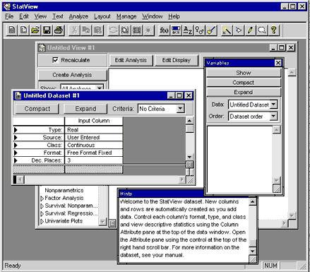

Around 2017, Christopher Chabris, Tal Yarkoni, Julia Rohrer and others conducted the Loss of Confidence Project, in which authors were encouraged to publicly declare instances where they were no longer confident in the claims made in one of their prior publications. [Rohrer et al. (2021)](https://journals.sagepub.com/doi/10.1177/1745691620964106) is absolutely worth a read.

I saw it at the time when they were recruiting co-authors, but one of the requirements was that participants had to take full responsibility for the work they had lost confidence in (in order to avoid finger pointing at other coauthors of the original work, etc.). The work I had already lost confidence in at the time was conducted for my bachelors thesis, and I felt at the time that I would unfairly take full responsibility for analytic decisions that my supervisor instructed me to take. In retrospect, this was splitting hairs, and I regret not being braver, getting involved in the project and being radically transparent. 

Over the years, I've often considered posting a Loss of Confidence statement like this. The more (forensic) meta-science work I do, the more important it feels to be transparent about what of my work I (currently) am confident in or not. I recently wrote a separate piece on [my recent and current research interests](https://mmmdata.io/research/). This reignited thoughts about a Loss of Confidence statement, which is effectively the other side of the coin: the publications which I would encourage prospective students and colleagues not to read. So, here it is.

**tl;dr: As with much of the psychology literature, disregard a lot of the empirical work from before about 2015.**

 

### Hussey & Barnes-Holmes (2012) 

Hussey & Barnes-Holmes (2012) The Implicit Relational Assessment Procedure as a measure of implicit depression and the role of psychological flexibility. *Cognitive and Behavioral Practice*. https://doi.org/10.1016/j.cbpra.2012.03.002 

**Summary**

- Confidence in computational reproducibility: ✅ (probably)
- Confidence in replicability: ❌
- Confidence in measurement validity: ❌
- Confidence in claims: ❌
- I recommend you do not cite, attempt to build on, or even read this article.

**Details**

This work was conducted for my bachelors thesis project in 2009. It's *p*-hacked to death, although that word didn't even exist until 2010 and I probably didn't learn it until 2012 or really appreciate its meaning until 2015 or so. Pick your poison, they're all in there: optional stopping, flexibility in scoring, median split of a continuous variable, multi-way interaction effects. 

My recollection is that I successfully computationally reproduced the reported results from the final data set around 2015, when I first started learning R. The original analyses were conducted in statview, a statistics package not even sold since 1997, but which somehow refused to die in that research group, continuing to see until at least 2015. Unfortunately, I don't have the files for this any more to know for sure. The point is moot given that the reported analyses are just one of many, many forking paths. 

 

 

I've subsequently written lots (e.g., see [this post](https://mmmdata.io/posts/2025/04/irapresearch.org-website-relaunched/)) on my more general Loss of Confidence in the validity of the IRAP, the measure used in the study. 

More importantly, I'm aware of at least one unpublished independent conceptual replication of the study that failed to replicate the group differences or interaction. 

I have told people about all of the above privately for years, but it's worth being explicit here: I have lost confidence in the claims contained in that article, including but not limited to the claim that depression is associated with differences in the patterns of implicit bias / brief and immediate relational responding related to depressive statements. 

The current norms of science are such that it is practically unheard of to self-retract an article "merely" for *p*-hacking, so I have not made an attempt to do so. When I've asked colleagues for their opinions on this over the years, the feedback I get is that it would be akin to self-flagellation. Nonetheless, I continue to be concerned by it in a way I can't shake, given that it continues to be cited (116 citations on Google scholar at time of writing). 

 

### O’Regan, Farina, Hussey, & Roche (2015) 

O’Regan, Farina, Hussey, & Roche (2015) Event-related brain potentials reveal correlates of the transformation of stimulus functions through derived relations in healthy humans. *Brain Research*. https://doi.org/10.1016/j.brainres.2014.12.044

**Summary**

- Confidence in computational reproducibility: 🤷‍♂️
- Confidence in replicability: 🤷‍♂️
- Confidence in measurement validity: ❌/🤷‍♂️
- Confidence in claims: 🤷‍♂️

**Details**

This work was conducted very early in my PhD using a small grant we obtained for between-research-group collaborations. It is Lego Science: I had a behavioral task 'block' (derived relational responding via Matching to Sample task) and they had a neuro 'block' (EEG), neither of us deeply understood the other's, but we clicked the blocks together to build a publishable unit. It's not so much that I have lost confidence in it, rather I'm not sure I ever really had it. Not for any deep concern, just a general sense of bewilderment. 

 

 

### Finn, Barnes-Holmes, Hussey, & Graddy (2017) 

Finn, Barnes-Holmes, Hussey, & Graddy (2017) Exploring the behavioral dynamics of the implicit relational assessment procedure: The impact of three types of introductory rules. *The Psychological Record*.

**Summary**

- Confidence in computational reproducibility: ✅
- Confidence in replicability: ✅
- Confidence in measurement validity: ❌
- Confidence in claims: ❌

**Details**

I'm confident that the general finding is replicable, i.e., that IRAP trial types that should intuitively show equivalent effects do not, because it has been both directly and conceptually replicated by at least three teams (see [Hussey & Drake, 2020](https://osf.io/preprints/psyarxiv/sp6jx/)). However, the specific claims regarding the explanations for this effect presented in this article are, in my opinion, vague just-so stories based on weak evidence and questionable analyses.

Some time after publication, I obtained the data for the studies I wasn't direcly involved in and successfully reproduced the reported results (to the best of my recollection). However, the appropriateness of some analyses and the conclusions drawn are likely inappropriate. For example, continuous variables are dichotomized (oof) and then subjected to a Chi-square test (double oof, this is just a less powerful t test), and then labelled an "individual level analysis" in the article (triple oof, it is still very much a group level analysis). This served to prolong and confuse the debate about whether the IRAP has individual level utility, which I argue it does not ([Hussey, 2020](https://osf.io/w2ygr)). because the task has very poor reliability ([Hussey & Drake, 2020](https://osf.io/ge3k7)). 

Beyond the results presented, the claims in article relate to what the authors call the STTDE effect, and therefore contributed to the [Gish Gallop](https://en.wikipedia.org/wiki/Gish_gallop) present in a lot of the Relational Frame Theory literature whereby new acronyms for theories and concepts are created with much more enthusiasm that they are ever tested, including AARR, BIRR/EERR, REC, DAARE, STDDE, MDML, HDML, and so forth. That broader theoretical car crash is beyond the scope of this post, and likely better to [satirize](https://bsky.app/profile/ianhussey.mmmdata.io/post/3lrfiourvvc2y) than directly critique given the claims are [Not Even Wrong](https://en.wikipedia.org/wiki/Not_even_wrong): 

## Acknowledgements

Thank you to Sabrina Norwood and Jamie Cummins for their comments on previous drafts of this post.
