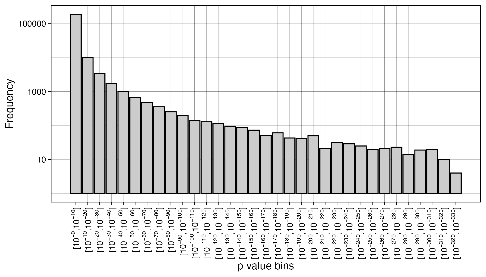

[Heathers and Meyerowitz-Katz (2024)](https://osf.io/6hste) recently proposed smaller-than-a-lowest-threshold (STALT) checks as a method to assess the credibility and trustworthiness of published articles. The simple idea here is that *p*-values are often reported to be smaller than a given threshold, e.g., "*p* < .001", but how much smaller? Their proposal is that if the reported test statistic or degrees of freedom are untrustworthy, the *p*-value may be incredibly and implausibly small. This is closely related to the idea that massive effect sizes (e.g., Cohen's *d* above say 2 or 5, depending on the context) are implausible, given that the effect size's confidence intervals and the *p*-values are re-expressions of one another. 

Along with Nick Brown, Heathers is the OG producer of forensic meta-science methods like GRIM, SPRITE, umbrella plots, and others, so when he has a new idea it's worth paying attention. 

My first question was: how small is too small? Trustworthy *p*-values should be right skewed and small. Plus, given that almost all stats software tends to truncate *p*-values, and we in psychology reflexively avoid scientific notation such as "$p < 10^{-9}$" like the plague because of our math phobia, I don't have a good intuition for how small untruncated trustworthy *p*-values tend to be. For this post, we'll have to temporarily overcome this phobia for scientific notation, because numbers with hundreds of digits are terrible on the eye.

So, how small is small enough that we should take notice and wonder if something is wrong? Heathers and Meyerowitz-Katz (2024) discuss this on page 6 (edited for formatting of scientific notation):

> "This raises an interesting question – what lower bound should be considered suspicious? $p = 10^{-9}$ is beyond unlikely, but does it have a material difference to $p = 10^{-3}$? Only imperfect heuristics exist to determine this, and several can be employed. Specifically: 
> a. Equivalent comparisons from real world examples of large p-values 
> b. Equivalent comparisons from related papers in the same field
> c. The above, but for effect sizes With the above in mind, the existing literature can be canvassed for comparative figures. While there is no direct statistical correspondence between effect size and p-value, it is quite likely that any invented difference between two groups contains errors in both."

Heathers and Meyerowitz-Katz (2024) don't provide such analyses in their preprint, so I thought I'd take a stab at it. I've worked with the data set of APA publications used for the original statcheck article before (Hussey et al., 2025; Nuijten et al., 2017), so it seemed a useful place to start. This data set has 208,914 *p*-values recalculated from test statistics and degrees of freedom extracted from the text of 74,470 psychology articles. 

Put simply, I'm trying to address a relatively simple question: Heathers and Meyerowitz-Katz (2024) argue that "$p = 10^{-9}$ is beyond unlikely", and I'm not sure that's the case. I suspect that recalculated *p*-values with 9 decimal places are actually fairly common. 

Heathers and Meyerowitz-Katz (2024) note that STALT checks can be done with any calculator that does not truncate the recalculated *p*-value. It's useful to note that the [R package statcheck's](https://cran.r-project.org/web/packages/statcheck/index.html) (Nuijten et al., 2024) `statcheck()` function does this (although most web app implementations of it don't), therefore statcheck also provides a useful implementation of STALT too (hence, STALT-check). Reapplying statcheck to the articles and retaining the untruncated *p*-values allows us to observe their distribution. To aid interpretation, I then bin the values in very wide bins, i.e., *p*-values with between 0 and 10 leading zeros, between 10 and 20, etc. As a quick technical note, recomputed *p*-values smaller than about $10^{-324}$ cannot be represented using double precision floating point numbers and are stored in memory simply as 0. As many others have noted, floating point numbers, and especially very small numbers, are weird (e.g., [Navarro, 2025](https://blog.djnavarro.net/posts/2025-05-18_multivariate-normal-sampling-floating-point/)). 

 

 

Inspection of the plot suggests that $p = 10^{-9}$ is not "beyond unlikely", its actually the bin with the largest number of observations. Of course, these bins are very coarse; within this bin, *p*-values with zero to three leading zeros almost certainly more common than smaller ones, despite this not being visible from this plot. But in the grand scheme of things, those with 9 are not especially unusual or rare. This may (or may not) have implications for whether these values are therefore untrustworthy. 

This becomes even more apparent when we calculate percentiles and find the number of leading zeros that defines round number percentiles (i.e., where 90%, 95%, 97.5%, 99%, 99.5%, and 99.9% of implied *p*-values have no more than this number of leading zeros).

| Value of $x$ in $p \ge 10^{-x}$ | Percentile |
|------------------------------:|-----------:|
|                             9 |       90.8 |
|                            17 |       95.1 |
|                            32 |       97.5 |
|                            66 |       99.0 |
|                           105 |       99.5 |
|                           223 |       99.9 |

  

From the table, 90.8% of implied *p*-values are larger than $10^{-9}$. Or, conversely, about one in ten implied *p*-values are smaller than this again. 

Of course, this is purely descriptive: it tells us what size *p*-values are implied by the reported test statistics and degrees of freedom in the literature. It doesn't tell us what proportion of those (implied) *p*-values are themselves trustworthy or not. This would require more in-depth inspection of the individual articles, which is beyond the scope of this post. Perhaps some or even many of the small *p*-values in the literature are untrustworthy. Either STALT issues are extremely prevalent, or perhaps *p* = $10^{-9}$ is not small enough to consider suspicious.

One option would be to use a more extreme threshold, perhaps based on the frequency with which they are observed in the literature. From the table above, implied $p \le 10^{-17}$ are in the top 5% of smallest values. To get to the top 1%, $p \le 10^{-66}$ is needed. The top .1% requires $p \le 10^{-223}$. 

Of course, it could be plausible that STALT issues are extremely prevalent. After all, roughly half of examined psychology articles (36/71) have GRIM inconsistencies (Brown & Heathers, 2017), and roughly half of psychology articles have statcheck errors (Nuijten et al., 2016). However, whereas methods like GRIM and statcheck tell us whether reported values are mathematically *possible*, given assumptions, and therefore inconsistencies are more likely to represent trustworthiness errors (i.e., have fewer false positives), STALT seeks to tell us whether values are *plausible*. This is a much more normative claim that is harder to answer, especially when implied *p*-values of a given size are quite common in the literature. 

For researchers interested in using STALT, it's important to clarify what the inference is. With GRIM/statcheck/etc., it is relatively clear to state that "under various assumptions, these reported statistical results are inconsistent, and therefore their trustworthiness is impacted." In practice, users of GRIM/statcheck/etc. often use them to make "hmm, that looks weird.." observations that motivate further scrutiny of the article. If that's how you plan to use STALT, i.e., merely as a quick and dirty method to motivate further inspection, maybe that's fine. But bear in mind you may find lots of false positives from implied *p*-values that may not be diagnostic of other issues. However, I would currently caution against using STALT as the former: because STALT speaks to *plausibility* not *possibility*, small implied *p*-values - especially ones that are not in fact that rare in the literature - cannot tell us much about the trustworthiness of those *p*-values or the article as a whole. 

This further reinforces the need for validation of STALT against other forensic meta-science methods before we know its utility. STALT may be easier to calculate than other metrics, but at present it remains considerably more difficult to interpret.

## Code 

All code and processed data is available at https://github.com/ianhussey/staltcheck. 

## References

Brown, N. J. L., & Heathers, J. A. J. (2017). The GRIM Test: A Simple Technique Detects Numerous Anomalies in the Reporting of Results in Psychology. Social Psychological and Personality Science, 8(4), 363–369. https://doi.org/10.1177/1948550616673876

Heathers, J., & Meyerowitz-Katz, G. (2024). ‘Yes, but how much smaller?’ A simple observation about *p*-values in academic fraud detection. https://doi.org/10.17605/OSF.IO/2SP5B

Hussey, I., Alsalti, T., Bosco, F., Elson, M., & Arslan, R. (2025). An Aberrant Abundance of Cronbach’s Alpha Values at .70. Advances in Methods and Practices in Psychological Science, 8(1), 25152459241287123. https://doi.org/10.1177/25152459241287123

Navarro, D. (2025, May 18). When good pseudorandom numbers go bad. Notes from a Data Witch. https://blog.djnavarro.net/posts/2025-05-18_multivariate-normal-sampling-floating-point/

Nuijten, M. B., Hartgerink, C. H. J., van Assen, M. A. L. M., Epskamp, S., & Wicherts, J. M. (2016). The prevalence of statistical reporting errors in psychology (1985–2013). Behavior Research Methods, 48(4), 1205–1226. https://doi.org/10.3758/s13428-015-0664-2

