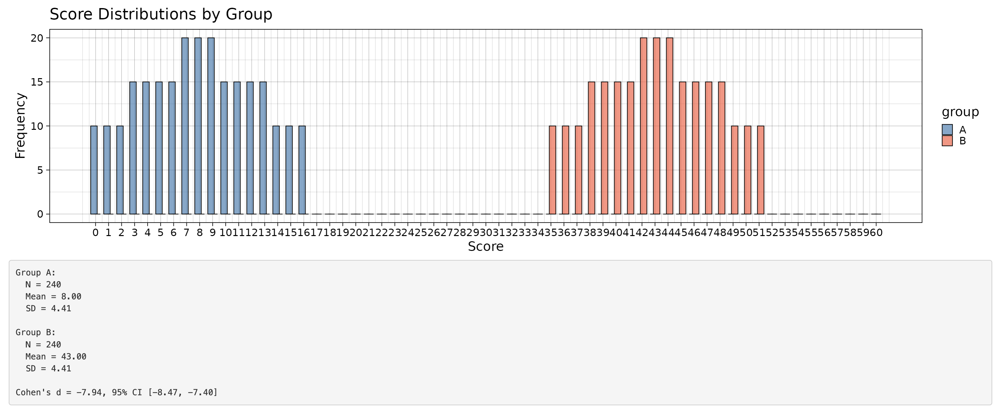

I've spent a lot of time thinking about the plausibility of standardized effect sizes in the last year. From a trustworthiness assessment perspective, (standardized) effect sizes have a great combination of being commonly reported, easy to look into, having values that range in their plausibility, and - when they go wrong - being at least somewhat diagnostic of other things having also gone wrong. 

They are in the top left corner which makes them Cool and Good. For these reasons, they are useful to include in our critical thinking when reading any article or, more formally, as part of a Trustworthiness Assessment (e.g., using [Wilkinson et al.'s (2025) INSPECT-SR](https://www.medrxiv.org/content/10.1101/2024.11.25.24316905v3) tool).

 

 

In this post, I focus on Cohen's $d$ standardized mean difference effect sizes.

So, how large an effect size should make us balk? 

On the one hand, and let's get this out of the way nice and quickly: nuance is needed, fields differ, etc. Psychophysics, for one, defies the norms of other fields because their effects are legitimately huge. 

On the other hand, literally no-one is proposing that effect sizes beyond a specific cut-off be used to send you to Science Naughtiness Jail. Rather, the question is what rules of thumb might be useful heuristics for readers to think about the credibility of the work they read. 

One useful starting point is to have an intuition for norms in the literature. [Bogdan (2025)](https://doi.org/10.1177/25152459251323480) scraped data from 173,926 psychology articles published between 2004 and 2024 and extracted p values and effect size metrics. His article is worth a read. Further analysis of that data set can tell us lots about the distribution of Cohen's *d* effect sizes in the psychology literature as a whole. 

I extracted 23,089 Cohen's *d* effect sizes that were explicitly reported in text (e.g., "Cohen's *d* = 0.21"). Cohen's *d* can also be estimated from *t*-tests' degrees of freedom and *t* values, akin to how statcheck also recomputes *p*-values from these ([Nuijten et al., 2016](https://doi.org/10.3758/s13428-015-0664-2)). For the sake of simplicity, I assumed all *t*-tests are independent rather than dependent, as the Cohen's *d* calculation differs slightly between them, although it doesn't change the distribution very much. 454,687 Cohen's $d_s$ estimates could be calculated from reported *t*-tests. The right tail of both distributions are very long, so I only plot the 0-99th percentiles. 

 

 

Or in percentiles:

 

| Percentile | \|$d$\| | \|$d_s$\| estimated from *t* test |
| ---------: | ------: | --------------------------------: |
|          1 |    0.02 |                              0.02 |
|          5 |    0.07 |                              0.09 |
|         10 |    0.13 |                              0.17 |
|         25 |    0.29 |                              0.36 |
|         50 |    0.56 |                              0.71 |
|         75 |    1.01 |                              1.34 |
|         90 |    1.61 |                              2.40 |
|         95 |    2.30 |                              3.40 |
|         99 |    7.14 |                              7.48 |

 

Half of all explicitly reported Cohen's *d* values are less than .56. Once you're seeing Cohen's *d*s of 2 you are in the top 10%-ish of effect sizes - and indeed the sort of effects that generate them. 

Again, before anyone gets angry, I acknowledge that this doesn't differentiate between what is generating these effect sizes of course, which could range from population level interventions (which might have small effect sizes but be meaningful) to manipulation checks (which are often necessarily large, e.g., are these positive words more positive than these negative words). Caveat emptor, use your brain, etc. It could be broken down by subfield etc but that's beyond the scope of this post (see also [Glaser et al., 2023](https://osf.io/h368x)).

My emerging personal rule of thumb is that Cohen's *d* > 2 are often questionably plausible and invite more thought, and Cohen's *d* > 4 or 5 is *usually* borderline silly for things other than manipulation checks or positive controls ([Hilgard, 2021](https://doi.org/10.1016/j.jesp.2020.104082)).

This isn't to say that very large Cohen's *d* values of 5 or so can't occur; they can but they require a combination of very little variance within conditions and very large differences between conditions (i.e., the definition of Cohen's *d*). 

### Where you might see Cohen's d > 4 or 5

What sort of things produce Cohen's *d* values of 4 or 5 and are plausible? 

- "Chocolates are more desirable than human poop": Cohen's *d* = 4.52 ([Balcetis & Dunning, 2009](https://doi.org/10.1177/0956797609356283)).
- "Eating pretzels makes you thirstier than drinking water does": Cohen's *d* = 4.69 ([Balcetis & Dunning, 2009](https://doi.org/10.1177/0956797609356283)).
- Children tend to strongly agree that "girls tend to wear skirts" and strongly disagree that "boys tend to wear skirts": Cohen's *d* = 5.49 ([Streck & Kessels, 2024, unpublished poster presentation](https://raw.githubusercontent.com/ianhussey/blogdown-site/761ddc3c57423b2487e98b4ac009f434c618a983/content/posts/2025-07-26-cohens-d-8/streck_kessels_2024_gender_stereotypes_in_children.png)).
- In studies on the valences of thousands of traits, the difference between the most negative one ('racist') and the most positive ('loving'): Cohen's *d* = 7.97 ([Britz et al., 2023](https://doi.org/10.3758/s13428-022-01921-5)).

Although, as a quick aside, I have questions about even these effects, and am slowly working to replicate them (see also [Hilgard, 2021](https://doi.org/10.1016/j.jesp.2020.104082) on 'maximal positive controls').

### Where you should probably not see Cohen's d > 4 or 5

Conversely, there are contexts where we can say that it is relatively unlikely that we should observe very large Cohen's *d* values, such as Cohen's *d* = 8.0. One example would be RCTs on psychotherapy, given that we have lots and lots of information about effect sizes in that area (e.g., [Cuijpers et al., 2024](https://doi.org/10.1002/wps.21203)). Perhaps especially in clients who did not respond to prior treatments because, who may be more treatment resistant (although, for an excellent statistical critique of this common clinical assumption see [Senn, 2004](https://doi.org/10.1136/bmj.329.7472.966)). Perhaps especially at one-year follow up, given that demonstrating sustained improvement is always challenging.  

And yet, we can find such a effect in [Gloster et al.'s (2020)](https://doi.org/10.1016/j.cpr.2019.101810) meta-analysis of psychotherapy in for previous treatment non-res ponders. In that article, for unclear reasons, the authors censor Cohen's *d* values above 1, so their magnitude is not fully apparent from the forest plot. To make this clearer, I (successfully) reproduced the forest plot for efficacy at follow-up they presented in Figure 5.

 

 

Whew. This is either one of the most effective psychotherapy interventions that has ever been created, or something is amiss. The ability to spot this and think "hmm that doesn't look right" is a skill I think we should be training.

Equally, the meta-analysis for efficacy at the post-treatment time-point (their Figure 2) also contains some implausible or even impossible effect sizes:

 

 

On the one hand, I do believe there are contexts in which scientists should be able to quickly and efficiently point out "that's not true" without endless hand-wringing (see my other post [here](https://mmmdata.io/posts/2025/07/critique-does-not-require-solution/)). 

On the other hand, when trying to convince readers of the utility of looking into the plausibility of the magnitude of effect sizes, it's helpful to bring receipts that these effect sizes are indeed erroneous or untrustworthy. It's therefore important to note that these very large effect sizes cannot be correctly reproduced from the results reported in the original articles. 

In the case of Isasi et al. (2010), Gloster et al. (2020) appear to have made the "Standard Error error" here of confusing Standard Deviation and Standard Error, which inflates effect size. See various examples, commentary and study of this by [Maassen et al., 2020](https://doi.org/10.1371/journal.pone.0233107); tweets by [Charlton, 2022](https://x.com/AaronCharlton/status/1478927020528750594), statistical notes by [Altman & Bland, 2005](https://doi.org/10.1136/bmj.331.7521.903), and others. In the case of Moore and Blackwell (1997), it's unclear how Gloster et al. (2020) reached Cohen'd *d* = 1.65 as the original article reports *d* = -0.08.

### Visualizing Cohen's d from Likert data to build intuitions

When faced with a very large Cohen's *d* - not only when reading a study or meta-analysis but also when conducting one - it can be useful to think about the necessary implications of such an effect size. There are excellent Cohen's d visualization tools out there already (e.g., Kristoffer Magnusson's: [rpsychologist.com/cohend](https://rpsychologist.com/cohend)), but many of them assume the underlying data is continuous. Psychologists and other social scientists very often deal with Likert data made up of bounded integers, that is, sum scores from self-report scales where individuals' data are whole number with a logical minimum and maximum. I created a simply Shiny app  to manually construct and visualize Cohen's *d* from such bounded integer data: [errors.shinyapps.io/cohens-d-from-frequencies](https://errors.shinyapps.io/cohens-d-from-frequencies/).

This can be used to interrogate the estimate for Isasi et al. (2010) presented in Gloster et al. (2020) in terms of what is known about the scale. This outcome measure reported was the Young Mania Rating Scale (YMRS), which is a 0-60 scale that has been shown to have a SD of about 4.5 to 10 in clinical samples (*N* = 211 patients, [Targum et al. 2018](https://doi.org/10.1002/mpr.1729); *N* = 209, [Suppes et al. 2016](https://doi.org/10.1176/appi.ajp.2015.15060770); *N* = 3459, [Lukasiewicz et al., 2013](https://doi.org/10.1002/mpr.1379)). Using *SD* = 10, Cohen's *d* = 8 implies an 80 point difference between the intervention and control groups, and therefore can't be observed on the 0-60 YMRS scale. If we assume *SD* = 4.5, a Cohen's *d* of 8 implies a 36 point difference. Assuming *SD* = 4.5, let's also assume the very optimistic case that the intervention group has a very low mean of 8, this would require the control group to have a mean of 43. Large studies estimate the mean score on the YMRS in clinical samples is around 26, and a common cut-off for inclusion in RCTs is 20 ([Lukasiewicz et al., 2013](https://doi.org/10.1002/mpr.1379)). Assuming *SD* = 4.5, a Cohen's *d* of 8 would require not only the intervention to be extremely effective at 1-year follow-up, but also that all individuals in the control group would need to have very severe symptoms.   

 

 

Collectively, there is very good reason to doubt the veracity of the very large effect sizes reported in Gloster et al. (2020). Inspecting and verifying these concerns in detail like in the above can take some time, but merely observing Cohen's d = 8, 5, or perhaps even 2 in the context of a psychotherapy RCT can provide a useful starting point that signals the need for further scrutiny. Of course, ideally, these issues should be caught during the process of conducting a meta-analysis rather than years later when the article has already been cited a lot (65 times on Google Scholar at time of writing). 

We can also use this app to visualize extreme effect sizes on Likert scale. [Britz et al.'s (2023)](https://doi.org/10.3758/s13428-022-01921-5) study on the valence of traits is useful here as they report not only means and SDs but also the frequencies of each response on the 7-point scale and, unlike other studies providing norms for word valences they had a large number of ratings per word (*N* > 200). Of the 500 attributes they assessed, the most positive one ('loving') and the most negative one ('racist') have not only extreme means but, necessarily, small *SD*s due to the bounding of the scale. *SD*s are almost never zero in samples that are not extremely small, because even on topics most of us agree on there will be the occasional person who says that 'racist' is in fact a positive attribute, as happened here. This combination of large differences in means and small *SD*s produces a very large Cohen's *d* value: *d* = 7.97, 95% CI [7.39, 8.54]. The point to appreciate here is that, on a single-item 7-point scale, it extremely difficult to produce well-estimated Cohen's *d* values that are larger than this. 

 

 

Another useful demonstration from Britz et al.'s (2023) data is another pair of attributes that are not only extreme in their means and *SD*s but also antonyms: 'honest' and 'dishonest'. Even for words that are extremely valenced opposites, Cohen's *d* does not exceed 8: *d* = 7.76, 95% CI [7.19, 8.32]. 

 

 

Of course, there is no perfect one-to-one comparison between this and the Cohen's *d* of 8 reported in Gloster et al. (2020). Multi-item scales can produce smaller *SD*s and therefore larger Cohen's *d* values, and scales with wider ranges can produce larger differences in means. To a degree - but very unlikely enough to produce a legitimate effect size of Cohen's *d* = 8.0 in an RCT on psychotherapy vs control. 

While acknowledging the nuances of the comparisons of different scale ranges etc., effects like the above are a useful intuition pump. When encountering similarly large effect sizes in the literature, as yourself questions like: 

> "Is this psychotherapy really more effective compared to control than people think loving people are nicer than racists (Cohen's *d* = 7.76), or more effective than the degree to which people find chocolate more desirable than poop (Cohen's *d* = 4.52)?"

You can read more about the specifics of the issues I have raised about Gloster et al. (2020) in [this pubpeer comment](https://pubpeer.com/publications/B894E24B78C656FA21941142971CDE) or [this preprint (Hussey, 2025)](https://osf.io/preprints/psyarxiv/rbydj). More examples of extreme yet credible effect sizes in psychology can be found in [this](https://github.com/ianhussey/effect-size-distributions-and-extreme-examples) GitHub repository. 
