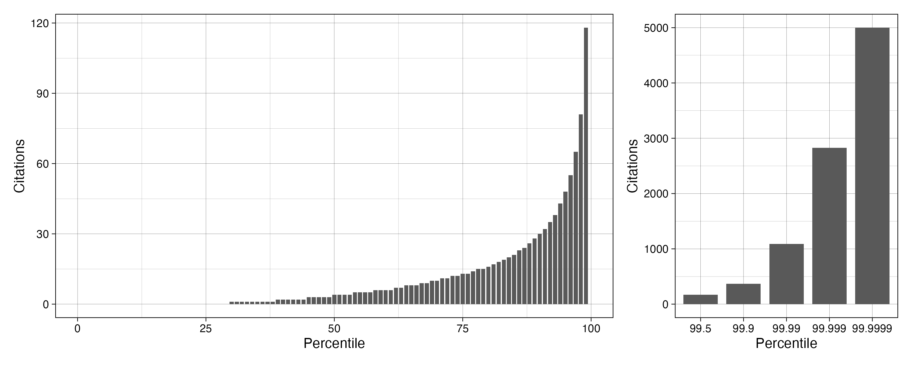
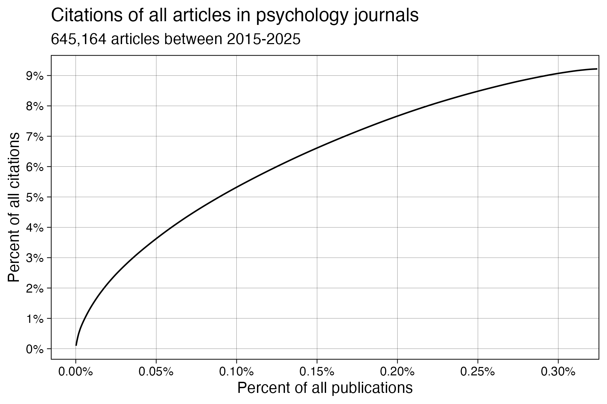
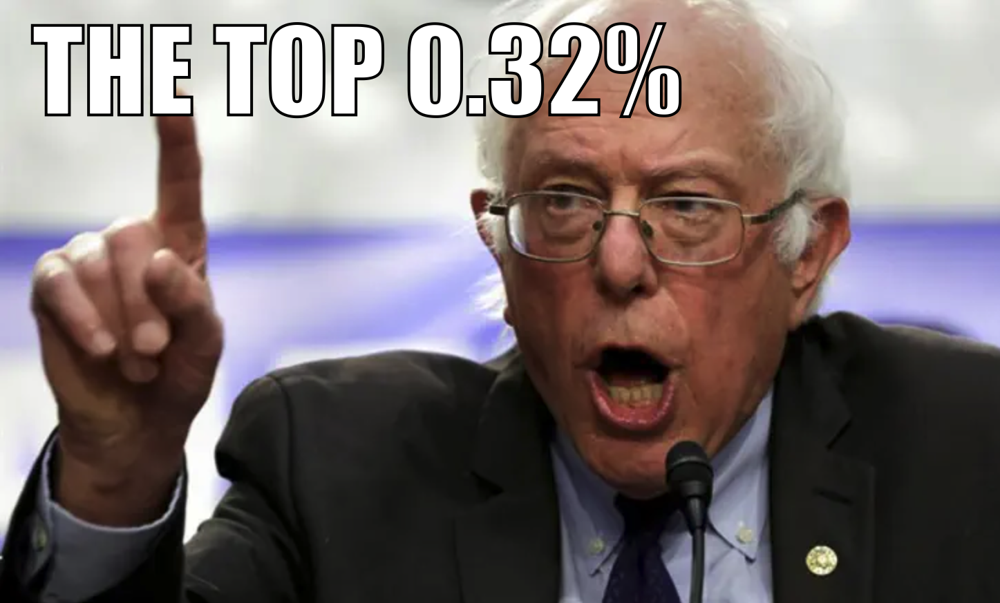

In their recent piece in the Chronicle of Higher Education "Social Science Is Broken. Here’s How to Fix It", [Gelman & King (2025)](https://www.chronicle.com/article/social-science-is-broken-heres-how-to-fix-it) argued that science needs "a post-publication, citation-triggered review process," where highly cited and therefore influential articles are automatically given post-publication peer review at a certain citation threshold. 

We very much agree. Our bug bounty program for science, ERROR (https://error.reviews), is already built on these principles:

1. Science would benefit from multiple parallel systems of verification in addition to pre-publication peer review, such as a more formalized post-publication peer review process.
2. Given finite time and resources, re-examining the most influential articles has the greatest potential to uncover important errors that might exist. 

 

 

ERROR also overcomes the limitation that Gelman and King (2025) noted: both peer reviewers and original authors are paid for the their time, with additional bonus payments made to either or both parties contingent on any errors detected. This can provide a much-needed incentive for this work.

### Skew in citations

Citations are *extremely* skewed: the vast majority of published articles are cited very few times, with a tiny minority being cited a lot ([Radicchi et al., 2008](https://doi.org/10.1073/pnas.0806977105)). What about in psychology specifically? Using the March 2025 CrossRef database, [Jamie Cummins](https://bsky.app/profile/jamiecummins.bsky.social) and I extracted all publications in all psychology journals and their citation counts. 

The modal number of citations of psychology articles is zero. 

In fact, receiving just a single citation put an article in the 30th percentile of articles published in the last decade. 

The top 1% of articles attract a very disproportionate number of citations. So much so that I had to make a second subplot for them to make the plot make sense: 

 

 

### Highly cited articles

As Gelman and King (2025) argue, this means that revisiting a tiny subset of all published articles to check them for errors could have an outsized impact on our collective knowledge.

Gelman and King (2025) estimated that, in political science, 5% of all published articles account for 28% of all citations. They suggested that a 250 citations threshold might be used as the criterion to trigger post publication review. We at ERROR have been using a slightly different criterion that tries to take the recency of the publication into account: ≥30 citations per year since publication. We had been applying this and searching for qualifying papers somewhat unsystematically until now, but Gelman & King's (2025) article prompted us to formalize this criterion and search strategy. 

Of the 645,164 publications (9.2%) in psychology journals in the last decade in the CrossRef database, just 2,092 articles (0.32%) received at least 30 citations per year since publication. 

 

9.2% of all citations go to just 0.32% of psychology articles.

 

Of course, others might choose different criteria, but the underlying point remains the same: Reevaluating such a subset of articles has great potential for identifying the most influential errors.  

 

 

### Systematizing recruitment to ERROR

Future invitations to participate in the ERROR bug bounty program will be randomly drawn from the list of DOIs we created using this criterion, which includes the top .32% of articles by citations. 

 

 

Doing so will increase the generalizability of ERROR's findings, although other sources of selection bias are likely to still be present. Most notably, because ERROR requires that the original authors give their consent for the article to be reviewed, this introduces a self-selection bias. Nonetheless, an estimate of the prevalence of errors in highly cited psychology articles may still be possible using methods such as Multilevel-regression and Post-stratification (see [Alsalti et al., 2023](https://osf.io/preprints/psyarxiv/fcm3n_v1)). 

 

### Data and code

All data and code to reproduce this search and analysis is available on the [ERROR GitHub repository](https://github.com/ianhussey/error-reviews).

 

### Appendix: Table of percentiles of citations

Some readers may prefer to see the precise number of citations that generated the plot above.

 

| Percentile | Citations |
| ---------: | --------: |
|    99.9999 |      4999 |
|     99.999 |      2828 |
|      99.99 |      1088 |
|       99.9 |       369 |
|       99.5 |       169 |
|         99 |       118 |
|         98 |        81 |
|         97 |        65 |
|         96 |        55 |
|         95 |        48 |
|         94 |        43 |
|         93 |        38 |
|         92 |        35 |
|         91 |        32 |
|         90 |        30 |
|         89 |        28 |
|         88 |        26 |
|         87 |        24 |
|         86 |        23 |
|         85 |        21 |
|         84 |        20 |
|         83 |        19 |
|         82 |        18 |
|         81 |        17 |
|         80 |        16 |
|         79 |        15 |
|         77 |        14 |
|         76 |        13 |
|         74 |        12 |
|         72 |        11 |
|         70 |        10 |
|         68 |         9 |
|         66 |         8 |
|         63 |         7 |
|         61 |         6 |
|         57 |         5 |
|         53 |         4 |
|         49 |         3 |
|         44 |         2 |
|         38 |         1 |
|       ≤ 29 |         0 |

 
