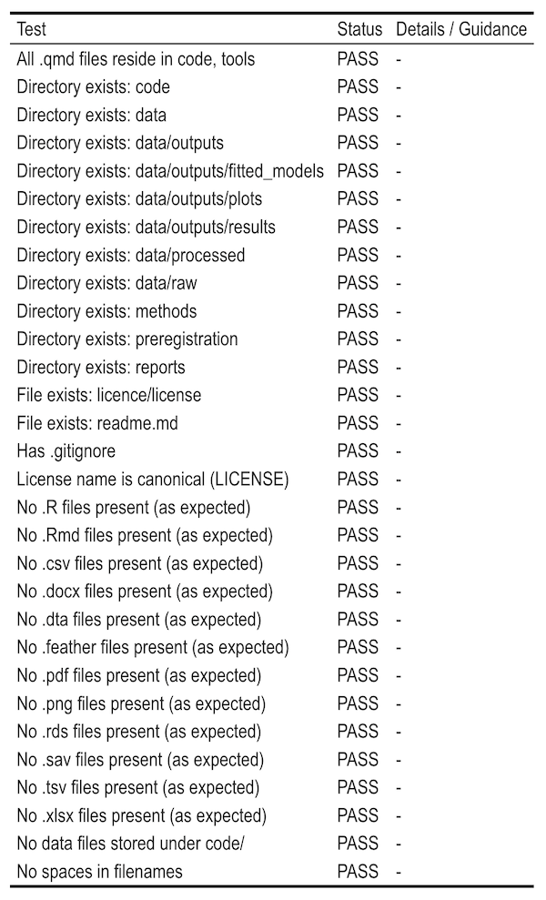

Making psychological code and data [FAIR](https://www.nature.com/articles/sdata201618) is hard, in part because different projects organize their code and data very differently. 

Sometimes this is for good reasons, such as due to the demands of a given project, study design, or the types of data it uses. 

Other times, this is for poorer reasons, like people not having spent much time thinking about digital project management or received any training in it. Let's face it, organizing data and code is a 'secondary task': one we do in order to complete the project, not as an end in itself. 

With prescribing a one-size-fits-all solution that is too rigid, psychology would greatly benefit from having a formal Data Standard that defines principles, shoulds, musts, and must-nots for how to organize data and code. 

Luckily, this already exists: [psych-DS](https://psych-ds.github.io/), the Psychology Data Standard. 

Not enough people have heard about the great work that Melissa Kline Struhl and collaborators have done on psych-DS. The [BIDS standard](https://bids.neuroimaging.io/index.html) for neuro data sees much wider use, and psychology has yet to catch up. 

*But*:

1. I am not *yet* convinced of the utility of psych-DS's .json requirement. a) .json files are a pain to create, and b) they are currently very rarely used in psychology workflows. So, personally, I'm not motivated to put the effort in to creating them or training my students to do so.
2. psych-DS is purposefully light-weight on what it requires users to do to be compliant. I'm OK being slightly more heavy handed, especially given that my use case is a) my own projects and b) training students to do it in my R/tidyverse classes.
3. psych-DS focuses on *testing* compliance with the standard - it has its own [validator web app](https://psych-ds.github.io/validator/) that you can check your projects with - but not (yet) on *assisting* the user in setting up a project that is compliant in the first place. Approached as a human-factors problem, this is likely to decrease uptake of psych-DS, given that tidying up a project after the fact is usually harder than providing a template up front.

### psych-DS ... ish

I wanted to make it easier to create and check R projects' conformity to a standard, so I created an R package to do it: [{psychdsish}](https://github.com/ianhussey/psychdsish)


psych-DS-ish is an R package that: 

1) Drops the .json requirement
1) Allows user to create skeleton project structures (`create_project_skeleton()`) (or, for testing, to delete them: `delete_project_skeleton()`)
1) Validate a given project against psych-DS-ish rules (`validator()`). 

"But Ian," I hear you ask, "doesn't this contribute to standards-proliferation?" 

Well, yes, unfortunately. 

<br>

<br>

psych-DS-ish makes no attempt to define or maintain the standard itself, which is its weak point and is psych-DS's strength. I have no desire to duplicate psych-DS's great work there. psych-DS-ish is intended to be a code tool not a full data standard. psych-DS-ish could be updated in future to bring it more in line with psych-DS, or psych-DS could distribute, fork, or otherwise make use of psych-DS-ish's skeleton generation tool. If you hate it, please feel free to fork the repo and add the .json requirement back in. Also, I made this in one day, cut me some slack, sheesh.

### Goal project structure

This is the generic project structure I aspire to and and teach. Jamie Cummins and I have discussed some choices at length, and it could change, as I know he feels differently about the organisation of multi-study projects and is OK with diverging further from the psych-DS standard. Maybe I'll be change my mind over time, or we'll add different skeleton archetypes.

The point here is that, once I had a project structure in mind along with the various musts and must-nots it entails, it's fairly easy to write a) a function that will generate this skeleton for the user and b) a function that can validate whether a given project conforms to these rules or not. 

``` text
github_repository_name/
├── .gitattributes
├── .gitignore
├── code/
│   ├── analysis.html
│   ├── analysis.qmd
│   ├── processing_study_1.html
│   ├── processing_study_2.html
│   └── ...
├── data/
│   ├── processed/
│   │   ├── study_1_processed_data.csv
│   │   ├── study_1_processed_codebook.xlsx
│   │   ├── study_2_processed_data.csv
│   │   ├── study_2_processed_codebook.xlsx
│   │   └── ...
│   ├── raw/
│   │   ├── study_1_raw_behavioraltask_data.csv
│   │   ├── study_2_raw_behavioraltask_data.csv
│   │   ├── study_1_raw_codebook.xlsx
│   │   ├── study_2_raw_codebook.xlsx
│   │   ├── study_1_raw_demographics_data.csv
│   │   ├── study_2_raw_demographics_data.csv
│   │   ├── study_1_raw_selfreports_data.csv
│   │   ├── study_2_raw_selfreports_data.csv
│   │   └── ...
│   └── outputs/
│       ├── plots/
│       │   ├── plot_1_self_reports.png
│       │   ├── plot_2_behavioral_task.png
│       │   └── ...
│       ├── fitted_models/
│       │   ├── fit_model_1.rds
│       │   ├── fit_model_2.rds
│       │   └── ...
│       ├── results/
│       │   ├── cor_matrix_study_1.csv
│       │   ├── cor_matrix_study_2.csv
│       │   └── ...
│       └── ...
├── LICENSE
├── methods/
│   ├── study_1/
│   │   ├── replication_instructions.docx
│   │   ├── study_1_labjs.json
│   │   ├── study_1_measures_and_procedure.docx
│   │   └── ...
│   └── study_2/
│       ├── replication_instructions.docx
│       ├── study_2_labjs.json
│       ├── study_2_measures_and_procedure.docx
│       └── ...
├── preregistration/
│   └── preregistration.docx
├── readme.md
├── reports/
│   ├── preprint/
│   │   ├── preprint.docx
│   │   └── ...
│   ├── presentations/
│   │   ├── conference_presentation.pptx
│   │   └── ...
│   └── ...
└── tools/
    ├── project_creator.qmd
    ├── project_validator.qmd
    └── ...
```

### Skeleton project structure created by create_project_skeleton()

The  `create_project_skeleton()` function creates the following project structure, including directories, license, readme, .gitignore, and Quarto templates with some defaults already set:

```text
github_repository_name/
├── .gitattributes  # ignores .html files to help github detect R repos
├── .gitignore  # includes reasonable defaults
├── LICENSE  # CC BY 4.0
├── readme.md  # including overview, structure, reproduciblity instructions, license, suggested citation
├── code/
│   ├── analysis.qmd  # template created
│   └── processing.qmd  # template created
├── data/
│   ├── outputs/
│   │   ├── fitted_models/
│   │   ├── plots/
│   │   └── results/
│   ├── processed/
│   └── raw/
├── methods/
├── preregistration/
└── reports/
```

### Validation rules checked by validator()

`validator()` checks whether a project is psych-DS-ish compliant if it follows all of the following rules:

| **File / Directory type** | **Allowed** | **Forbidden** |
|---------------------------|-------------|---------------|
| **Required directories**  | `code/`, `data/`, `data/raw/`, `data/processed/`, `data/outputs/`, `data/outputs/plots/`, `data/outputs/fitted_models/`, `data/outputs/results/`, `methods/`, `reports/`, `preregistration/` | Missing any of these directories |
| **Required files**        | `readme.md` (case-insensitive), license file (`LICENSE` preferred) | Missing either required file |
| **.qmd**, **.Rmd**, **.R** | In `code/` or `tools/` | Anywhere else |
| **.csv**, **.xlsx**, **.tsv**, **.dta**, **.sav**, **.feather**, **.rds** | In `data/` | Anywhere else (including `code/`) |
| **.pdf**                  | In `data/outputs/` or `data/raw/` | Anywhere else |
| **.png**                  | In `data/outputs/plots/` or `data/raw/` | Anywhere else |
| **.docx**                 | In `reports/`, `methods/`, `preregistration/`, `data/outputs/results/`, or `data/raw/` | Anywhere else |
| **.html**                 | In `code/` or `methods/` | Anywhere else |
| **Data-like files under `code/`** | None | Any `.csv`, `.xlsx`, `.tsv`, `.sav`, `.dta`, `.feather`, `.rds` |
| **.gitignore**            | Present and configured to ignore R session files, caches, large binaries | Absent |
| **Filenames**             | No spaces | Any filename containing spaces |

### Usage

Before running the 'project_creator.qmd' script:


<br>

After running the 'project_creator.qmd' script:


<br>

You can also use the function directly from the console without needing the .qmd file, if you know your project's file path. E.g., `psychdsish::create_project_skeleton(project_root = "~/git/my_project")`.

<br>

Results of `validator()` in a freshly generated project skeleton - note that some tests are not printed unless failed:



<br>

In future, instead of just instructing students how they *should* organize a project and having to spend lots of time and thought giving them feedback on where they've gone wrong, {psychdsish} can now generate a template for them and allow them to check as the project progresses whether they're still adhering to these principles.

If you find {psychdsish} to be useful in your research or teaching, or have suggestions for how to change it, please get in touch.  
