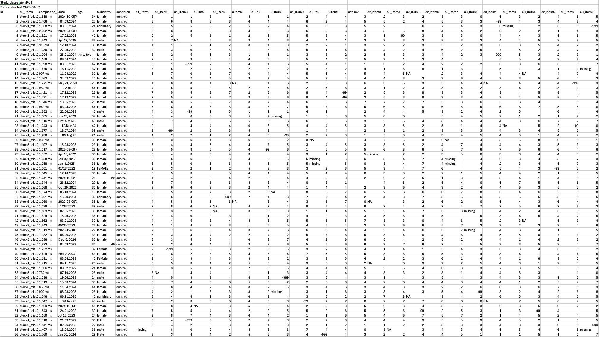

[{truffle}](https://github.com/ianhussey/truffle) is an R package for teaching users to process data. 

It allows you to create datasets with various known effects to be rediscovered (truffles, via `truffle_` functions), and then create data processing headaches that have to be solved (dirt, via `dirt_` functions). Users must then search for truffles among the dirt. 

Generated datasets can include demographics variables and item-level Likert responses. Known effects (truffles) can be buried in the data including differences in sum-score means between conditions, known correlations between the different outcomes' sum-scores, known Cronbach's alpha values for each scale, etc. 

Data can then be made dirty in several different ways to create common data processing challenges, such as poorly named columns that disagree with R, duplicate rows, missingness with irregular codings, mixed date formats, untidy demographics data with misspellings and erroneous entries, number columns with comma seperators and units, impossible values beyond the scale range, header rows that disrupt reading data into R, and untidy columns that contain more than one variable. 

Users can then be set the challenge to properly wrangle the dataset to remove the dirt and uncover the truffle, e.g., to answer questions like "are there significant differences between groups, and of what effect size?"

Note that the package's functions are currently quite fragile: it is designed for a specific use-case for my teaching and not (yet) highly flexible, nor does it contain unit tests or handle errors well. Currently the `truffle_` functions can only generate data for a single study design: a between groups experiment with equal sample sizes. It's likely I'll extend this to cover other cases in the future.


## Existing R packages

Other packages exist to cover some of these features, but none fit mine and not all in the one place. For example:

Data generation/simulation:

- [{lavaan}](https://lavaan.ugent.be/) :  Used internally by {truffle} to generate observed variables from latent models, allow you to generate data with specific population Cronbach's alpha values, M, SD, associtions, etc. {lavaan} is quite focused on non-experimental design. You can generate seperate datasets that systematically differ in their means, as I have done in {truffle}, but it's not the most common use-case that {lavaan} caters to. 
- [{latent2likert}](https://latent2likert.lalovic.io/) : Used internally by {truffle} to convert continuous observed variables to Likert with minimal distortion.
- [{faux}](https://debruine.github.io/faux/) : Can also be used to generate multilevel data for correlational or experimental designs, but not both at the same time, at least in the way I wanted. Maybe I'm wrong - {faux} is definitely worth a look. Also contains functions for converting continuous data to Likert with minimal distortion.
- [{fabricatr}](https://declaredesign.org/r/fabricatr/), part of the {declardesign} packages : A very interesting set of packages that I have not fully gotten my head around, despite Dorthy Bishop's encouragement that more people do so. 
- [{wakefield}](https://github.com/trinker/wakefield) : A popular package for generating simulated data, {wakefield} is particularly useful for generating common demographic and psychological data columns, but also repeated measures and time series data. However, it's not orientated towards multilevel structures, as far as I understand.  

Adding mess, dirt, and data processing challenges:

- {wakefield} and {fabricatr} :  As well as generating data, both packages also allow you to add problems. 
- [{messy}](https://github.com/nrennie/messy) : A cool package for adding messiness to existing data. However, I wanted to make much, much more mess.
- [{toddler}](https://github.com/rbcavanaugh/toddler) : Very well named and adds even more mess than {messy}, but I wanted even more chaos.


## Usage

Generate data for the following experiment design (between groups factorial design with two groups):

- Item level Likert data (no choice)
- Between subjects experiment (control vs intervention) (2 conditions only, but can be renamed)
- Three outcome variables (arbitrary number)
- Known Cronbach's alpha for each scale (arbitrary number)
- Known number of items per scale (arbitrary number)
- Known number of Likert response options (1:k)
- Known correlations between the latent scale scores
- Known APPROXIMATE Cohen's d between the two conditions' latent scale scores (arbitrary number, but recovered value will differ due to reliability, distortion due to converting continuous data to Likert, etc.)

``` r
library(truffle)
library(knitr)
library(kableExtra)

dat_truffle <- 
  truffle_likert(study_design = "factorial_between2",
                 n_per_condition = 5,
                 factors  = "X1_latent",
                 prefixes = "X1_item",
                 alpha = .70,
                 n_items = 5,
                 n_levels = 7,
                 approx_d_between_groups = 0.50,
                 seed = 42) |>
  truffle_demographics()

dat_truffle |>
  head(n = 10) |>
  kable() |>
  kable_classic(full_width = FALSE)
```

Output:


<br>

Check that the sum scores conform to the predefined properties and that the item level data is approximately normal.

``` r
truffle_check(dat_truffle)
```


Generate data for the same study but make the demographics data mess, add missingness, and add impossible values to the item level data.

``` r
dat_truffle_and_dirt <- 
  # make truffle
  ## Likert data with known effects
  truffle_likert(n_per_condition = 5,
                 factors  = "X1_latent",
                 prefixes = "X1_item",
                 alpha = .70,
                 n_items = 5,
                 n_levels = 7,
                 approx_d_between_groups = 0.50,
                 seed = 42) |>
  ## RT data (no within or between effects baked in)
  mutate(completion_time = truffle_reaction_times(n = n())) |>
  # add dirt
  dirt_demographics() |>
  dirt_impossible_values(prop = .04, replacement_value = 8) |>
  
  dirt_numbers(cols = "completion_time") |>
  dirt_dates(col = "date") |>
  dirt_missingness(prop = .05) |>
  dirt_untidy(col = "block_trial") |>
  dirt_duplicates(prop = 0.05) |>
  ## move some columns around before dirt_colnames() makes it hard
  relocate(date, .after = "id") |>
  relocate(completion_time, .after = "id") |>
  relocate(block_trial, .after = "id")
  dirt_colnames() 

dat_truffle_and_dirt |>
  head(n = 10) |>
  kable() |>
  kable_classic(full_width = FALSE)
```

Output:


<br>

Applied to a more complex design with three correlated outcomes, with more participants, and with broken headers, the data is now truly dirty. Perfect for training students to overcome the sort of data processing issues they'll encounter in the real world.




## Snuffle functions to help you find truffles 

`snuffle_` functions are designed to help the user find truffles (underlying effects) among the dirt (data processing issues). 

### Sum scores

Calculating sum scores is an extremely common task, and yet there are a surprising number of ways to mess it up given impossible scores in the dataset, missingness, and reversed items. 

`snuffle_sum_scores()` calculates sum scores, imputing missing values from each participant's mean. There are, of course, much better and more sophisticated ways to deal with item missingness, but this is probably the most common way - so much so that it's often not even reported in articles. The function also excludes data that are beyond the scale's response bounds (ie impossible values), and returns diagnostics on the number of missing items, which items were missing, the number of impossible values and which were missing. It can also reverse score a vector of specified items. 

Which items are used in the sum scoring can be specified in a number of ways, e.g., `select()`ing the items earlier in the chunk, or using a common naming prefix to select them (e.g., starting with "X1_"), or even a more sophisticated regex call to find the desired columns. 

```{r}
dat_truffle_and_dirt <- 
  truffle_likert(study_design = "factorial_between2",
                 n_per_condition = 10,
                 factors  = "X1_latent",
                 prefixes = "X1_item",
                 alpha = .70,
                 n_items = 5,
                 n_levels = 7,
                 approx_d_between_groups = 0.50,
                 seed = 42) |>
  truffle_demographics() |>
  dirt_missingness(prop = .10, dirtier = FALSE) |>
  dirt_impossible_values(prop = .04, replacement_value = 8)

dat_truffle_and_dirt_snuffled <- dat_truffle_and_dirt |>
  snuffle_sum_scores("X1_", 
                     min = 1, 
                     max = 7, 
                     id_col = "id")

dat_truffle_and_dirt_snuffled |>
  head(n = 20) |>
  kable() |>
  kable_classic(full_width = FALSE)
```

| id| age|gender    |condition | X1_item1| X1_item2| X1_item3| X1_item4| X1_item5| X1_n_nonmissing| X1_sum|X1_items                                         |X1_reversed_items | X1_n_impossible|X1_impossible_items | 
|--:|---:|:---------|:---------|--------:|--------:|--------:|--------:|--------:|---------------:|------:|:------------------------------------------------|:-----------------|---------------:|:-------------------| 
|  1|  41|female    |control   |        3|        3|        2|        1|       NA|               4|      9|X1_item1, X1_item2, X1_item3, X1_item4, X1_item5 |                  |               0|                    | 
|  2|  19|male      |control   |        6|        6|        3|        2|        7|               5|     24|X1_item1, X1_item2, X1_item3, X1_item4, X1_item5 |                  |               0|                    | 
|  3|  42|female    |control   |        4|        4|        3|        5|        2|               5|     18|X1_item1, X1_item2, X1_item3, X1_item4, X1_item5 |                  |               0|                    | 
|  4|  45|female    |control   |       NA|        2|        5|        3|        3|               4|     13|X1_item1, X1_item2, X1_item3, X1_item4, X1_item5 |                  |               0|                    | 
|  5|  28|female    |control   |        5|        2|        6|        3|        3|               5|     19|X1_item1, X1_item2, X1_item3, X1_item4, X1_item5 |                  |               0|                    | 
|  6|  31|female    |control   |        2|        5|        4|        4|        6|               5|     21|X1_item1, X1_item2, X1_item3, X1_item4, X1_item5 |                  |               0|                    |
|  7|  19|female    |control   |        2|       NA|        2|        3|        3|               4|     10|X1_item1, X1_item2, X1_item3, X1_item4, X1_item5 |                  |               1|X1_item2            | 
|  8|  45|female    |control   |        2|        5|        2|        7|        3|               5|     19|X1_item1, X1_item2, X1_item3, X1_item4, X1_item5 |                  |               0|                    | 
|  9|  19|female    |control   |        1|       NA|       NA|        5|        2|               3|      8|X1_item1, X1_item2, X1_item3, X1_item4, X1_item5 |                  |               1|X1_item2            | 
| 10|  44|female    |control   |        4|        6|        3|        3|        5|               5|     21|X1_item1, X1_item2, X1_item3, X1_item4, X1_item5 |                  |               0|                    | 
| 11|  27|nonbinary |treatment |        5|       NA|        2|       NA|        3|               3|     10|X1_item1, X1_item2, X1_item3, X1_item4, X1_item5 |                  |               1|X1_item4            | 
| 12|  42|male      |treatment |        6|        5|        5|        5|        6|               5|     27|X1_item1, X1_item2, X1_item3, X1_item4, X1_item5 |                  |               0|                    | 
| 13|  45|female    |treatment |        2|        3|        3|       NA|        2|               4|     10|X1_item1, X1_item2, X1_item3, X1_item4, X1_item5 |                  |               0|                    | 
| 14|  39|male      |treatment |        3|        6|        3|        2|        5|               5|     19|X1_item1, X1_item2, X1_item3, X1_item4, X1_item5 |                  |               0|                    | 
| 15|  22|female    |treatment |        4|        3|        4|        6|        6|               5|     23|X1_item1, X1_item2, X1_item3, X1_item4, X1_item5 |                  |               0|                    | 
| 16|  27|female    |treatment |        5|        4|        5|        2|        5|               5|     21|X1_item1, X1_item2, X1_item3, X1_item4, X1_item5 |                  |               0|                    |
| 17|  34|female    |treatment |        4|        2|       NA|       NA|       NA|               2|      6|X1_item1, X1_item2, X1_item3, X1_item4, X1_item5 |                  |               0|                    | 
| 18|  34|female    |treatment |        5|        3|        5|        3|        6|               5|     22|X1_item1, X1_item2, X1_item3, X1_item4, X1_item5 |                  |               0|                    | 
| 19|  22|female    |treatment |        7|       NA|        6|        7|        7|               4|     27|X1_item1, X1_item2, X1_item3, X1_item4, X1_item5 |                  |               1|X1_item2            | 
| 20|  20|female    |treatment |       NA|       NA|        3|        3|        4|               3|     10|X1_item1, X1_item2, X1_item3, X1_item4, X1_item5 |                  |               0|                    |


## Code

You can find the code [here](https://github.com/ianhussey/truffle) or install {truffle} using `devtools::install_github("ianhussey/truffle")`.

